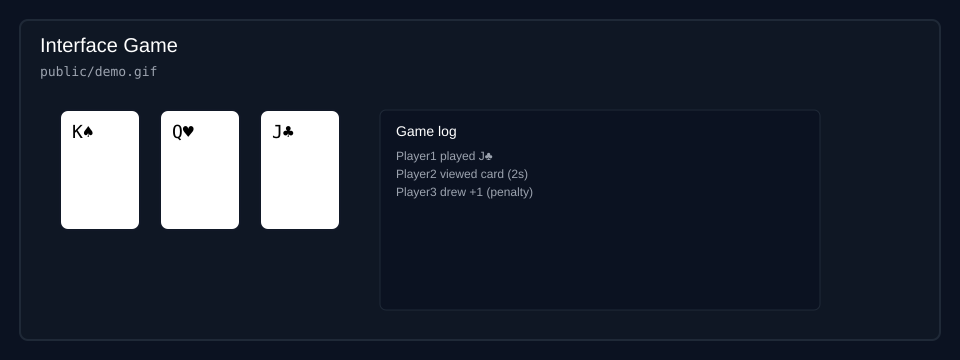

# Kartu Terkecil — Multiplayer Web

[](https://github.com/LixUb/Interface-Game/actions)
[](https://coveralls.io/github/LixUb/Interface-Game)
[](https://nodejs.org/)
[](LICENSE)
[](https://github.com/LixUb)



---

Bahasa Indonesia

Kartu Terkecil adalah permainan kartu multiplayer realtime berbasis web. Server bersifat authoritative: logika permainan, dek, dan validasi dijalankan di server sementara klien hanya menampilkan UI dan mengirim aksi pemain.

Status: Proyek siswa / proof-of-concept

## Fitur utama
- Mode Classic: 4–15 pemain (otomatis memakai 2 deck untuk 13–15 pemain)
- Mode 1v1 Duel: tepat 2 pemain
- Real-time sync dengan Socket.IO
- Server-authoritative: aturan dan penalti diproses di server
- Mudah dijalankan secara lokal atau dalam LAN

## Demo & Screenshot
Screenshot/GIF demonstrasi disimpan di `public/` dan disisipkan di atas. Ganti `public/screenshot.svg` atau tambahkan `public/demo.gif` dengan rekaman nyata untuk menampilkan gameplay.

## Menjalankan secara lokal
```bash
npm install
npm start
```
Server akan mendengarkan pada PORT yang ditentukan oleh `process.env.PORT` atau default 3000.
Buka http://localhost:3000 untuk memulai permainan.

### Menjalankan di LAN
1. Jalankan server pada satu PC.
2. Cari IP lokal PC server, mis. `192.168.1.10`.
3. Pemain lain membuka `http://192.168.1.10:3000`.

## Aturan singkat (yang diimplementasikan)
- 4–15 pemain; urutan join menentukan giliran searah jarum jam.
- Setiap pemain mendapat 4 kartu awal.
- Pada awal permainan, pemain dapat melihat tepat 2 kartu sendiri selama 3 detik.
- Kartu rangkaian aksi:
  - 7/8: lihat 1 kartu sendiri yang belum diketahui selama 2 detik.
  - 9/10: lihat 1 kartu lawan selama 2 detik.
  - J: tukar 1 kartu dengan lawan secara tertutup.
  - Q dan K hitam: bandingkan 1 kartu sendiri dengan 1 kartu lawan; kartu terlihat 2 detik lalu pemain memilih tukar atau tidak.
  - K merah: bernilai -2 (tanpa efek khusus selain nilai).
  - K hitam: bernilai 13 (efek sama seperti Q — lihat, banding, dan bisa tukar).
- Buang kartu dengan rank yang sama seperti kartu teratas dapat dilakukan kapan saja.
- Salah membuang atau memasang kartu mendapat penalti +1 kartu dari deck.
- Dek habis juga mengakhiri permainan.
- Siapa pun boleh deklarasi "Selesai"; setelah deklarasi, semua pemain lain mendapat tepat 1 giliran terakhir dimulai dari pemain setelah deklarator, lalu semua kartu dibuka dan skor dihitung.
- Untuk 13–15 pemain server otomatis memakai 2 deck remi standar (tanpa joker) sehingga kartu yang sama dapat muncul lebih dari sekali.

## Desain & Catatan teknis
- Server autoritatif mencegah cheating: semua aksi divalidasi di server.
- Socket.IO digunakan untuk komunikasi realtime. Pastikan WebSockets diaktifkan bila dideploy ke platform yang memerlukan pengaturan khusus (mis. Azure App Service).
- Arsitektur saat ini cocok untuk satu instance; jangan melakukan scale-out tanpa mekanisme shared state / adapter (Redis, socket.io-adapter, dsb.).

---

English

Kartu Terkecil is a realtime multiplayer web card game. The server is authoritative: game logic, deck handling, and rule validation run on the server while clients render UI and send player actions.

Status: student project / proof-of-concept

## Key features
- Classic mode: 4–15 players (2 decks used automatically for 13–15 players)
- 1v1 Duel mode: exactly 2 players
- Real-time sync using Socket.IO
- Server-authoritative: rules and penalties enforced server-side
- Easy to run locally or on a LAN

## Demo & Screenshot
A demonstration image is included in `public/screenshot.svg`. Replace `public/screenshot.svg` or add `public/demo.gif` with an actual gameplay capture to show the game in the README.

## Requirements
- Node.js (LTS recommended)
- npm

## Running locally
```bash
npm install
npm start
```
The server listens on `process.env.PORT` or defaults to 3000.
Open http://localhost:3000 to start the game.

### Running on LAN
1. Run the server on one PC.
2. Find the server's local IP, e.g. `192.168.1.10`.
3. Other players open `http://192.168.1.10:3000`.

## Implemented rules (short)
- 4–15 players; join order determines clockwise turn order.
- Each player receives 4 initial cards.
- At game start, players may see exactly 2 of their own cards for 3 seconds.
- Action cards:
  - 7/8: view one unknown own card for 2 seconds.
  - 9/10: view one opponent card for 2 seconds.
  - J: swap one card with an opponent privately.
  - Q and black K: compare one own card with one opponent card; both cards are revealed for 2 seconds then player chooses to swap or not.
  - Red K: value -2 (no special effect besides value).
  - Black K: value 13 (same effect as Q — view, compare, optional swap).
- You may discard a card that matches the rank of the top discard at any time.
- Illegal discard/play: penalty of drawing +1 card from the deck.
- Game also ends when the deck is exhausted.
- Any player may declare "Selesai" (Finished); after declaration each other player gets exactly one final turn starting from the player after the declarer, then all cards are revealed and scoring is done.
- For 13–15 players the server uses two standard decks (no jokers) so identical cards may appear more than once.

## Design notes & scaling
- Server-authoritative prevents cheating and centralizes game state.
- Socket.IO provides realtime messaging. When deploying to hosting platforms, make sure WebSockets are enabled.
- The current architecture targets a single instance. Do not scale out without adding a shared adapter/backplane (Redis + socket.io-adapter) for Socket.IO.

## Contributing
Contributions are welcome. Typical contributions:
- Fix UI/UX bugs
- Improve documentation
- Add tests or server-side validation

How to contribute:
1. Fork the repo
2. Create a feature branch: `git checkout -b fix/readme`
3. Commit and push
4. Open a pull request

## Troubleshooting
- If realtime connections fail after deploy, verify WebSockets are enabled on the hosting platform.
- If the server cannot bind to a port, ensure `PORT` is set by the hosting environment.

## License
License: MIT

## Contact
Open an issue in the repo for questions or demo requests.
